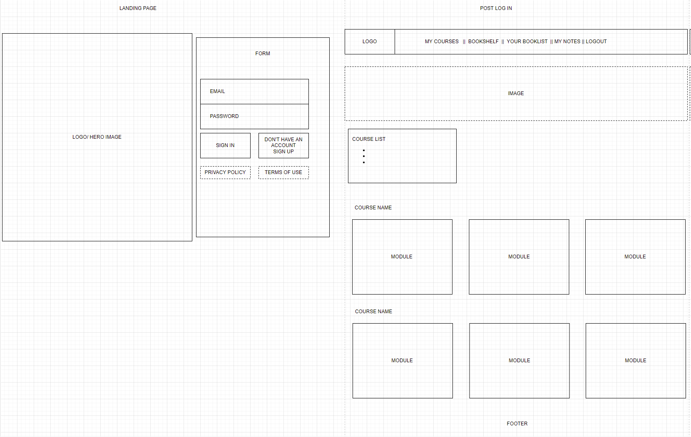
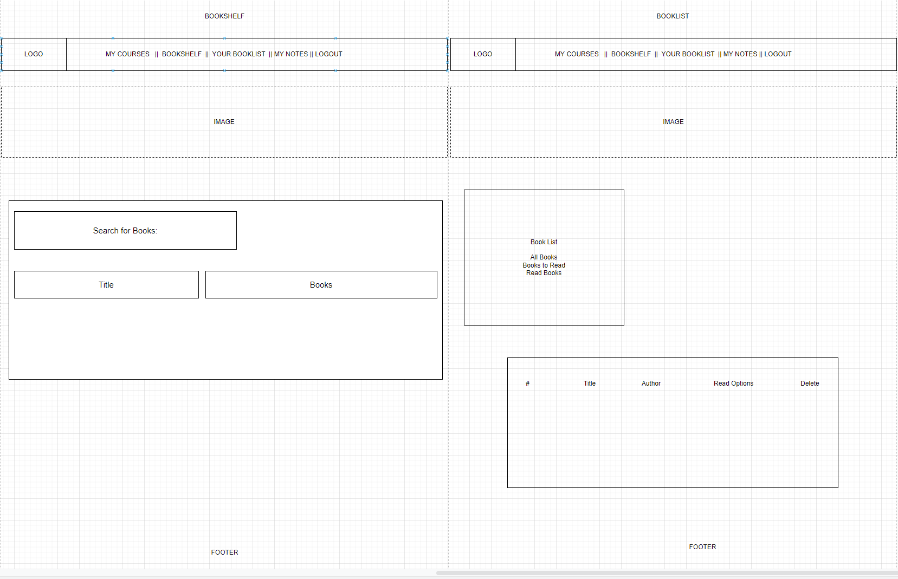
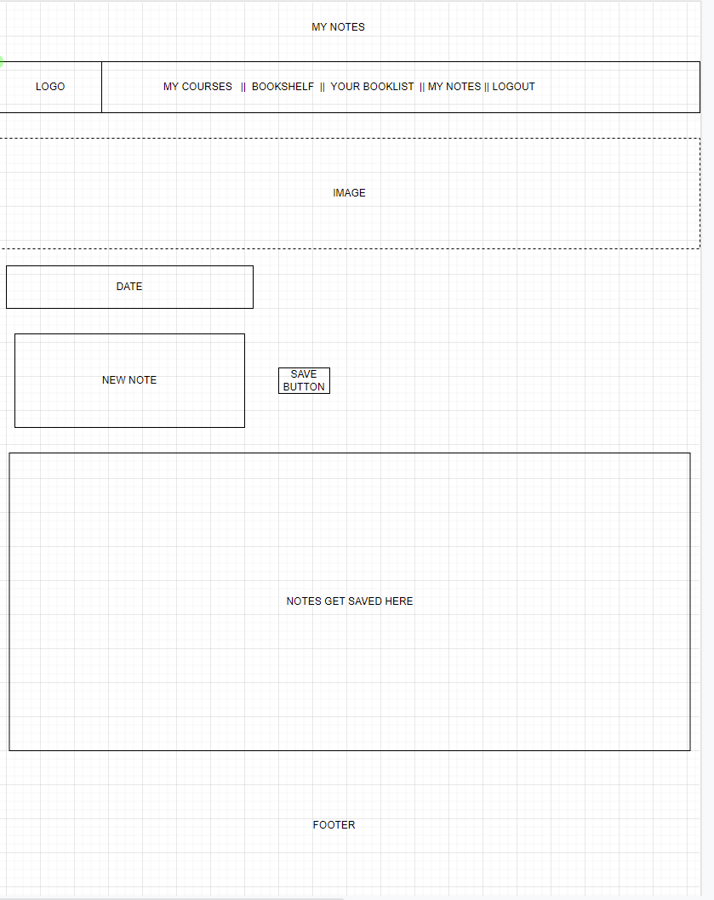
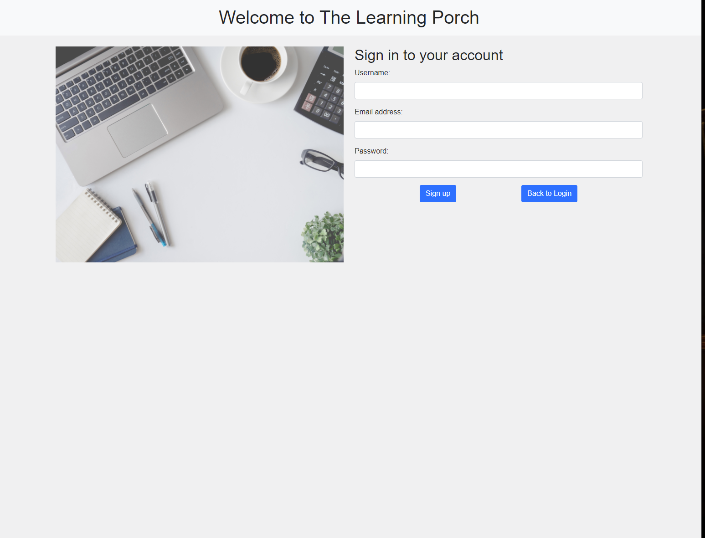
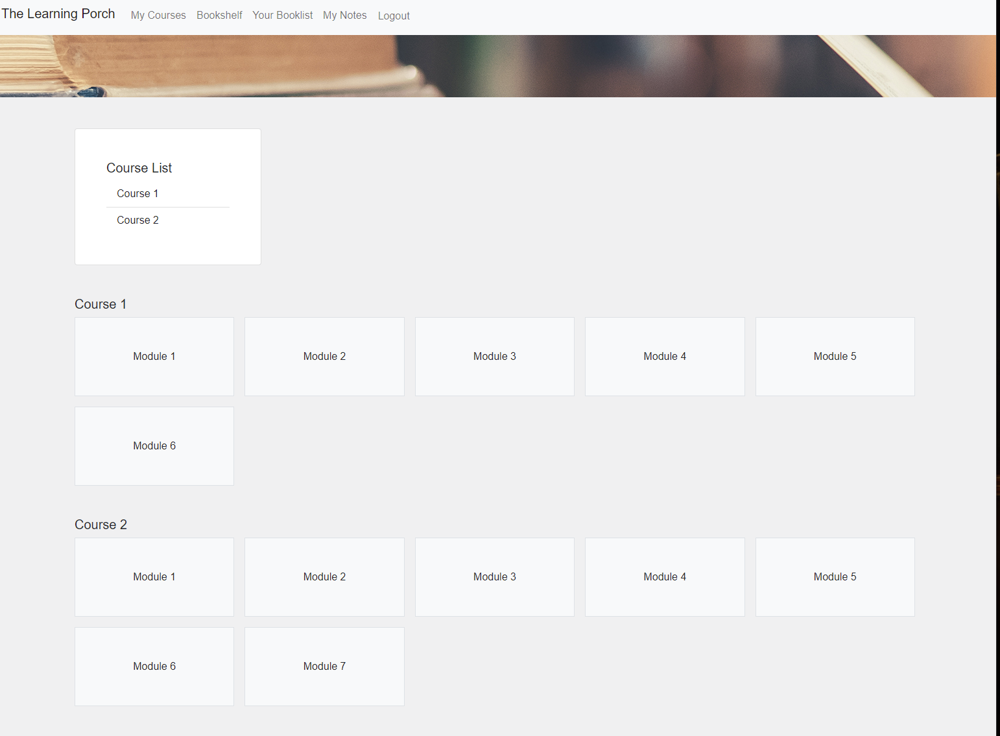
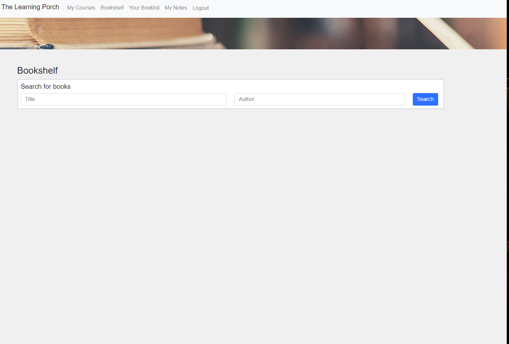
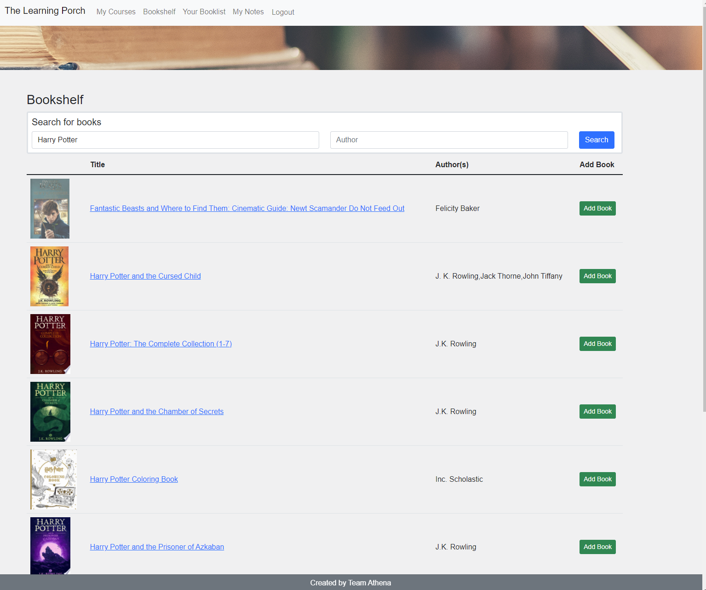
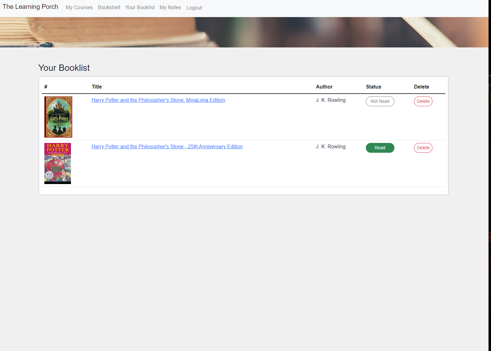
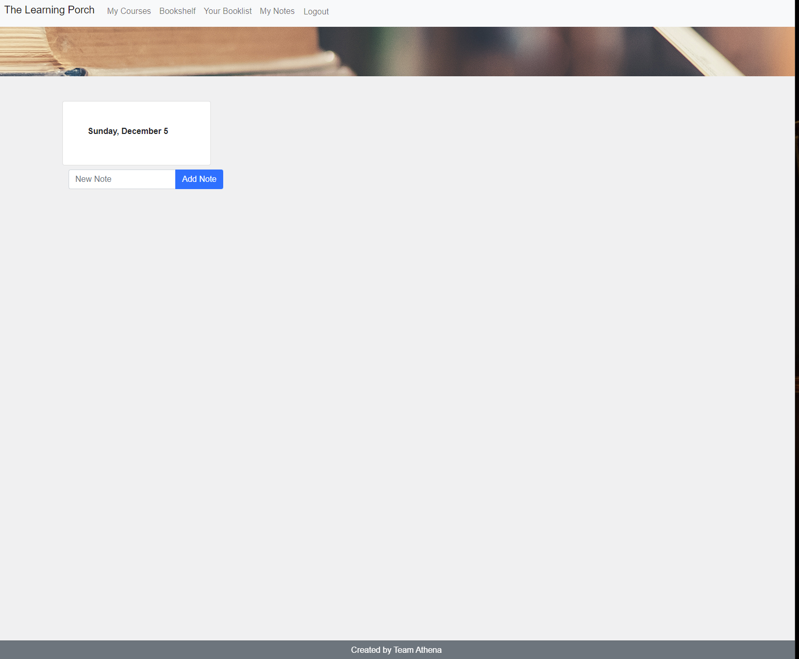

## Welcome to Learning Porch!
Learning Porch is created to act as an additional resource for students to use in order to gain additional knowledge in their area of study.

## Objective
Help students by offering courses and an e-book library in order to help achieve higher grades through our tutoring service.

## Application Requirements

- Use Node.js and Express.js to create a RESTful API.
- Use Handlebars.js as the templating engine.
- Use MySQL and the Sequelize ORM for the database.
- Have both GET and POST routes for retrieving and adding new data.
- Be deployed using Heroku (with data).
- Use at least one new library, package, or technology that we haven’t discussed.
- Have a polished UI.
- Be responsive.
- Be interactive (i.e., accept and respond to user input).
- Have a folder structure that meets the MVC paradigm.
- Include authentication (express-session and cookies).
- Protect API keys and sensitive information with environment variables.
- Have a clean repository that meets quality coding standards (file structure, naming conventions, follows best practices for class/id naming conventions, indentation, quality comments, etc.).
- Have a quality README (with unique name, description, technologies used, screenshot, and link to deployed application).

## Motivation for Development

As all of us being students learning new content, extra resources are extremely helpful. Learning Porch offers courses on all areas of study that students can select based on what they would like to learn. They can also search for e-books as well and add them to their booklist which they can later access. Lastly, there is an option where students can add notes as well. The goal of Learning Porch is to be an extra resource for students to look upon in order to gain knowledge.

## User Story

As being a student interested in gaining additional knowledge outside of class, I want a webpage where I can access modules related to my area of study with an e-book library to access books.

In the e-book library, I want to be able to select a book from a dropdown list.

I should be able to add the books to a booklist which I can access later on.

I should be able to write notes that will be saved to access later.

I should have an option to sign up then login with my specific username/password each time.

## User Workflow

WHEN I enter the application
THEN I am prompted to sign up/enter my email and password
WHEN I enter this prompted information
THEN I am provided with my course modules
WHEN I select the Bookshelf option
THEN I am provided to select a book from a dropdown list
WHEN I select the book
THEN I have the option to add it to my Booklist
WHEN I select my Notes
THEN I have the option to add and save notes

## Technologies Used

Platforms: VS Code, Github, Heroku
Libraries: Express.js, Node.js, SQL, Sequelize, Bootstrap, EJS

## Wireframe

## Challenges

- Setting up library
- Incorporating an API
- Making EJS and Handlebars work simultaneously 

## Successes

- Collaboration
    - Attending daily meetings
    - Giving our feedback to all team members 

- Good Team Sport
    - Encouraging one another
    - Being respectful/flexible to each other’s time

- Communication
    - Always voiced our opinions in a positive manner

## Directions for Future Development

As mentioned above, this is MVP #1 for Learning Porch.

At the time of this submission, our team has done it's best to meet all the requirements of this project. Despite this, there is room for improvement and listed below are some additional features or functionality that we will be improving with time and as we continue our journey through this coding bootcamp.

- Incorporate Google Books API
- Adding a delete function to note-taker
- Add read/unread functionality to books
- Add calendar to help students stay on track

## Screenshots of Web Application

## Links

Deployed Application:  https://the-learning-porch.herokuapp.com/

Github Repo: https://github.com/ToiletTakos/learning-porch

## Closing Remarks

Thank you for taking the time to learn about our web application, Learning Porch. We are committed to providing students with a great resource in order to gain the additional knowledge needed to strive!

